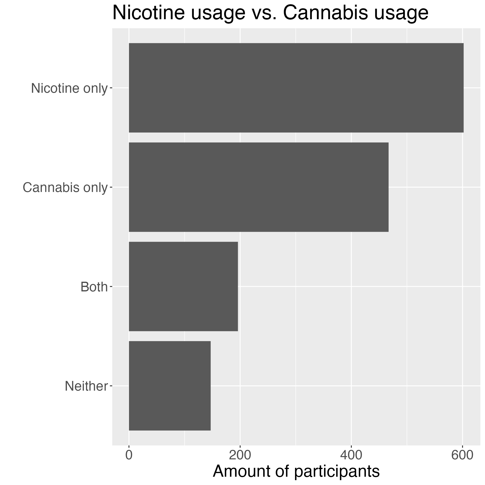
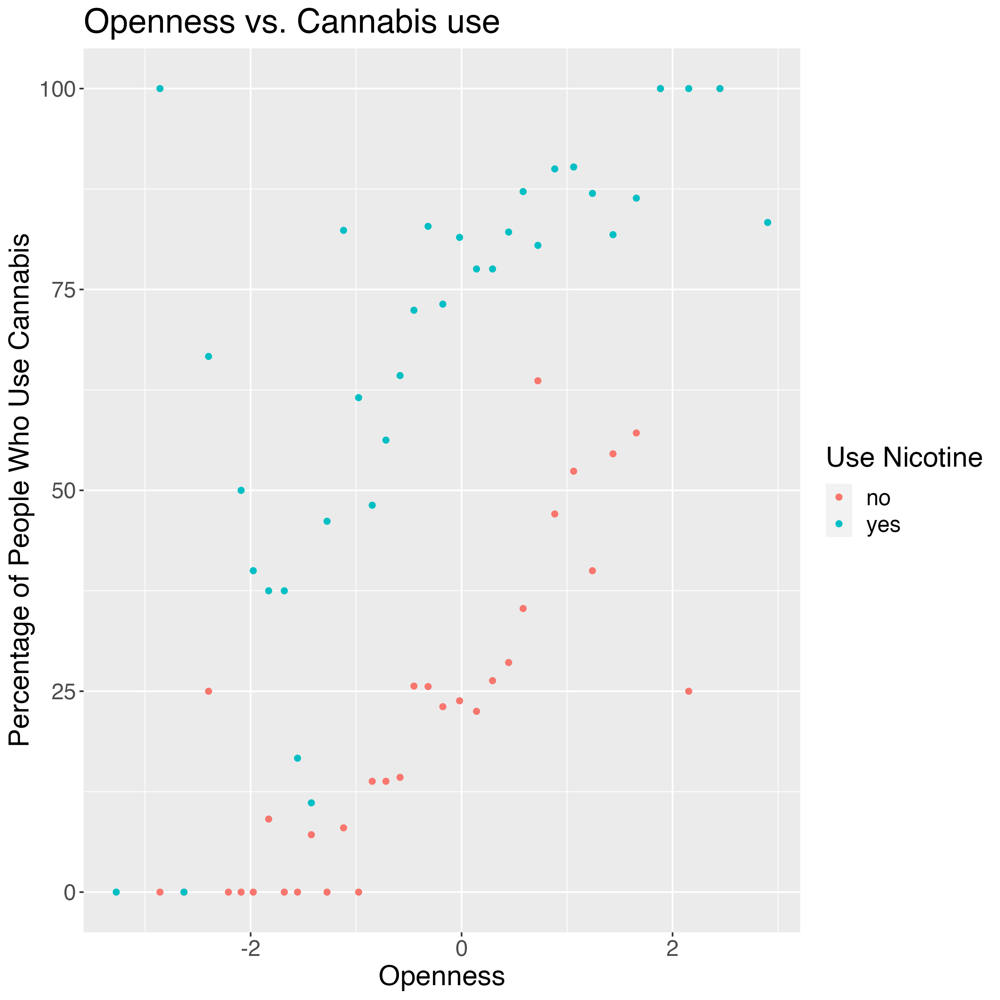
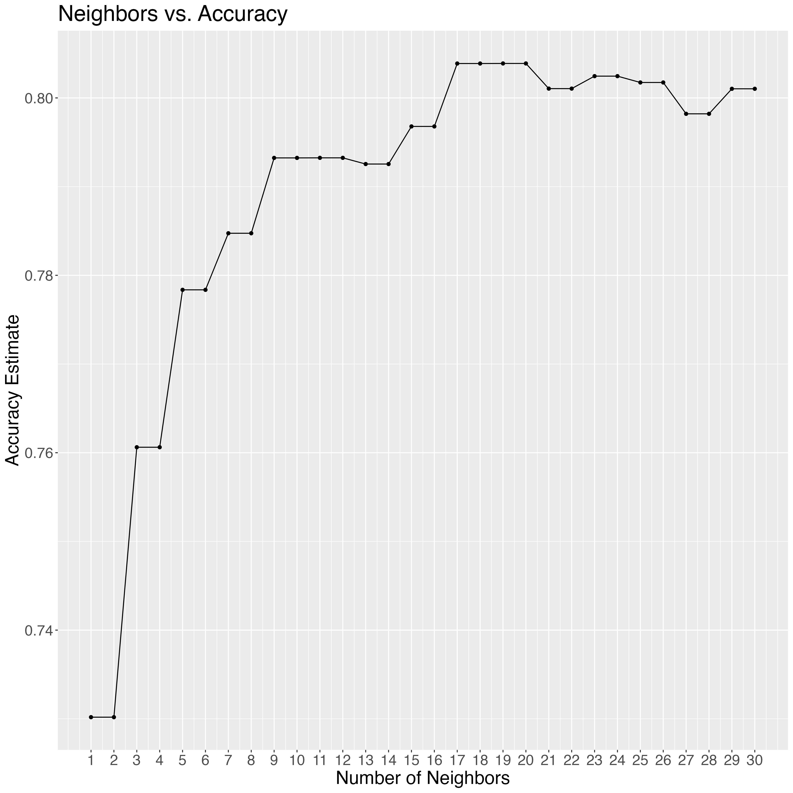

```{r setup, include=FALSE}
knitr::opts_chunk$set(echo = TRUE)
```

```{r message=FALSE, echo = FALSE ,warning=FALSE}
library(tidyverse)
library(tidymodels)
library(repr)
library(dplyr)
library(tidyr)
```

```{r message=FALSE, echo =FALSE, warning=FALSE}
set.seed(1) 
```

# **Summary**

This project aims to predict cannabis use based on demographic patterns,
personality traits, and nicotine use. A survey collected between 2011 to
2012 of 1885 respondents from the UCI Machine Learning repository was
used as the main sample. By using age, gender, education, Big Five
personality traits, and nicotine use as predictors, we predicted how
likely an individual is to use cannabis. Based on the analysis, we were
able to predict an individual\'s probability of using cannabis with a
81% accuracy rate, using a 5-fold cross-validation and a K-nearest
neighbors classification algorithm with 23 neighbors. The findings
suggest that the algorithm can be used in the future with a
satisfactorily high degree of certainty in regards to its outputs.

# **Introduction**

Cannabis is a drug derived from the plant Cannabis. Commonly smoked, it can 
alter mental and physical states. With more and more governments around the 
globe legalizing recreational and/or medical cannabis use in recent years, its
popularity has surged.Meanwhile, nicotine is commonly consumed by smoking and 
alters the mood.Given that nicotine is consumed in a similar way and also in a 
similarcontext as cannabis, we wonder if there is a relationship between the use
of those drugs. This provokes the idea of determining what demographic patterns 
such as age and ethnicity there are among the people who have followed this trend.
Furthermore, personality traits,specifically those in the Five Factor Model of 
personality (i.e. openness, conscientiousness, extraversion, agreeableness, and 
neuroticism) have been shown to contribute to a person's drug usage. 

According to [@digman1990personality], these traits can be described as follows:
openness refers to a preference for novelty, conscientiousness explains one\'s 
tendency to be organized and careful, extraversion refers to one\'s preference 
for being in the company of others, agreeableness is a measure of one\'s level 
of agreement with others and neuroticism indicates a predisposition to experience
stress and negative emotions. Marijuana use is commonly seen in people having 
high openness (Oscore),low agreeableness (Ascore), low extraversion (Escore) 
and average neuroticism (Nscore), whereas smokers in general have a higher 
neuroticism (Nscore), lower agreeableness (Ascore), and lower conscientiousness 
(Cscore) [@terracciano2008five]. Furthermore, it has been found that a high level
of neuroticism (Nscore) and low scores on agreeableness (Ascore) and 
conscientiousness (Cscore) are associated with addictive behaviour -- these 
individuals have been described as more likely to experience negative emotions 
(high neuroticism), more likely to act on impulses, and engage in careless 
behaviour (low conscientiousness), as well as be more likely to stick to their 
own opinions (low agreeableness) [@dash2019big]. Thus, we pose the question, 
can we predict cannabis use based on demographics, the Big Five personality 
traits, and nicotine use? We chose to use the drug consumption dataset from the 
UCI Machine Learning repository. The dataset is a survey collected between 
2011 to 2012 of 1885 respondents questioned about their usage of 18 drugs 
[@fehrman2017five].The survey also collected information about their personality
(NEO-FFI-R, BIS-11, ImpSS) and demographics (level of education, age, country of
residence, ethnicity, and gender).

# **Methods & Results** 

We conducted our data analysis by using demographics (columns Age,Gender, Education), 
scores of each of the Big Five personality traits (columns Oscore, Cscore, Escore,
Ascore, Nscore), and nicotine use (column Nicotine) as the predictors. Based on 
these variables, we attempted to predict how likely an individual is to use 
cannabis (column Cannabis), our target variable. We chose not to use Ethnicity, 
Country, BIS-11, ImpSS, and the other drugs' consumptions as predictors and only
focused on nicotine usage. We decided to omit ethnicity and country
because the data set included a very limited variety of answers in those
two variables (e.g. far too often returning White for ethnicity).

Furthermore, since most of the literature we found about the
relationship between drug use and personality included only Big Five
Personality traits, we opted for omitting the other measures of
personality. In using 8 predictors, we aimed to balance obtaining a
meaningful insight from our data (by increasing our number of
predictors) while also limiting the amount of variables to simplify the
scope of our report (by decreasing our number of predictors). Previous
research has shown correlations between personality and drug usage and
thus, we believe that the Big Five Personality Traits, prior nicotine
use, and demographics like age and gender would certainly play a role in
cannabis use. Lastly, in order to perform a more focused analysis, we
decided to choose only two drugs to concentrate on: nicotine and
cannabis. As mentioned before, this choice was guided by the fact that
these two drugs are similar in terms of context and method of use.

``` {r raw-data-table, echo = FALSE,  message=FALSE, warning=FALSE}
raw_data <- read_csv("../data/raw/drug_consumption.csv")
knitr::kable(head(raw_data), align = "l", caption = "Summary table of the entire dataset.")
```

Now, we see that the drug usage is denoted as follows: \
CL0: never used the drug \
CL1: used the drug over a decade ago; \
CL2: used the drug in the last decade; \
CL3: used the drug in the last year; \
CL4: used the drug in the last month; \
CL5: used the drug in the last week; \
CL6: used the drug in the last day. \

We assume that someone who used the drug more than a year ago is not to
be considered a user, so we will mutate the values CL0, CL1, and CL2 to
no (does not use) and the rest to yes (used recently/still using). 

``` {r drugs-table, echo = FALSE,  message=FALSE, warning=FALSE}
drugs <- read_csv("../data/processed/drug_user_consumption.csv")
knitr::kable(head(drugs), align ="l", caption = "Summary table of the dataset used in the analysis.")
```

We used set.seed(1) to make sure results are reproducible. We then split
the data into a training and a testing set (75% training, 25% testing),
this gives us enough data to train our classifier with, while still
giving us 470 testing variables. Furthermore, since nicotine will be
used as a predictor, we want the testing set to have nicotine as a
numeric variable. 

``` {r cannabis-and-nicotine-table, echo = FALSE,  message=FALSE, warning=FALSE}
cannabis_and_nicotine <- read_csv("../data/processed/processed_training_data.csv")
knitr::kable(head(cannabis_and_nicotine), align ="l", caption = "Table of the number of individuals (n) that fall into each label.")
```

## Visualizations

First, we are interested in understanding the pattern of cannabis and
nicotine consumption in our sample. 

```{r cannabis-nicotine, echo = FALSE, out.width="60%", out_height = "%60%", fig.align='center', fig.cap = "Horizontal histogram of Nicotine usage vs Cannabis usage"}

```

Another relationship that we are interested in exploring is how the
personality trait \"Openness\", which measures how willing people are to
try new things, plays into marijuana and nicotine consumption. Here, we
will make a new column called rate to express the percentage of each
group that uses cannabis, as the data has been standardized and looking
at raw marijuana user data will simply give us a normal distribution.

```{r cannabis-graph, echo = FALSE, out.width="70%", out.height="70%", fig.align='center', fig.cap = "Scatter plot of cannabis use vs openness. Openness is the standardized personality Oscore."}

```

We see that the rate of cannabis and nicotine users increases with
larger openness scores, and we can also see that there are more people
that use both nicotine and cannabis than people who use strictly only
cannabis (more blue than red data points).

``` {r drug-data-table, echo = FALSE,  message=FALSE, warning=FALSE}
drug_data <- read_csv("../data/processed/standardized_training_data.csv")
knitr::kable(head(drug_data), align = "l", caption = "Table of used predictors with Nicotine standardized, where Nicotine is 1 indicates nicotine use and Nicotine is 0 indicates no nicotine use.")
```

## Classification

Firstly, we must tune our classifier in order to find the optimal number of neighbours to be used in our model.

``` {r drugs-workflow-table, echo = FALSE,  message=FALSE, warning=FALSE}
drugs_workflow <- read_csv("../data/processed/drugs_workflow_data.csv")
knitr::kable(head(drugs_workflow), align ="l", caption = "Table of accuracy estimates and standard error outputs corresponding to a few different values of K-neighbours.")
```

```{r acc-plot, echo = FALSE, out_width = "5%", out_height = "5%", fig.align='center', fig.cap = "Plot of accuracy estimate versus number of neighbours. Mean accuracy for different values of K-neighbours. K = 23 and K = 24 yield the highest accuracies, and after K exceeds 24, accuracy starts to decline."}

```

From the graph plotted in Figure \@ref(fig:acc-plot), we can see that the numbers of neighbours that give us the highest mean accuracy is 23 and 24. Because the drop in accuracy from 24 to 25 is much greater than the drop from 23 to 22, we have decided to use 23 as our K. It should be noted that using some other values for K would be just as reasonable in this case, e.g. 21, since the difference in accuracy is less than 1%.

``` {r drugs-pred-table, echo = FALSE,  message=FALSE, warning=FALSE}
drugs_pred <- read_csv("../data/processed/results_data.csv")
knitr::kable(head(drugs_pred), caption = "Table of prediction outputs for cannabis use. Predictors except Nicotine are scaled and therefore do not provide a clear indication of what predictor values contribute to suggesting that someone would use/not use cannabis. Nicotine = 1 indicates nicotine use and Nicotine = 0 indicates no nicotine use.")
```

Now, we pull the final accuracy rate for our classifier.

```{r accuracy, echo=FALSE, message=FALSE, warning= FALSE}
drug_acc <- read.csv("../data/processed/accuracy.csv")
drug_acc_rounded <- round(drug_acc,3)
drug_acc_rounded_percentage <- paste0(round(drug_acc,3) * 100, "%")
```

`r drug_acc`

The result is an accuracy of approximately `r drug_acc_rounded` or
`r drug_acc_rounded_percentage`.

# **Discussion**

## Summary of findings

By training our model by performing a 5-fold cross-validation and using
23 as the number of neighbours in our K-nearest neighbours
classification algorithm, we were able to predict one\'s probability of
using Cannabis based on age, gender, education and personality scores
with a `r drug_acc_rounded_percentage` accuracy.

## Evaluation of findings

From our analysis, we expected to find that our predictors as a whole
would be able to accurately classify someone\'s likelihood to be a
cannabis user. This was expected due to the fact that all of our
predictors have been linked to cannabis use in past research, in
particular, personality traits such as Openness and Agreeableness.
Previous research has shown that there is a correlation between
personality and drug use [@terracciano2008five]. The use of the
predictor of nicotine, as well as age has also been documented where
peer influence in adolescents has also been shown, where nicotine and
cannabis were consumed in conjunction with each [@herold2021association].

What we found matched our forecast: we were able to predict a person\'s
probability of using cannabis with a `r drug_acc_rounded_percentage` accuracy 
rate. Even though this rate is not as accurate as it has been in other studies 
and also not as high as we initially hoped, we believe it is high enough for us
to say that our algorithm can be used in the future with a satisfactorily high
degree of certainty in regards to its outputs.

## Limitations

Despite our findings, there are a few notable shortcomings, namely that
we cannot deduce how much one variable alone, for example, nicotine use,
affects predicting cannabis use; if we were interested in analyzing
that, we would have to make many, many classifications with one variable
paired with cannabis use at a time, which unfortunately would not be
very practical. Additionally, another flaw, although to a lesser extent
would be that our data is somewhat large and we have many predictors, so
in choosing to use K-nn classification (which does not perform well in
those conditions), our model's accuracy may have been hindered. Lastly,
it\'s also important to remember that this data was collected mainly
from Western countries such as the UK and the US, which likely impact
how generalizable our model will be. Thus, if we decide to use this same
algorithm with a data set from a non-Western origin, we must be
extremely cautious when evaluating the results.

## Impact

By identifying potential predictors for cannabis use such as personality
traits or demographics, this may lead to impacts like being able to
identify potential marijuana users, as well as aid in public health
modeling and future policy-making regarding Cannabis. This can also
potentially spread awareness and education of the drug across
communities experiencing drug-use crises.

Our findings may also lead to future questions e.g. Are the types of
people most likely to use Cannabis also likely to use stronger, or
possibly illicit drugs? Do the type of people unlikely to use Cannabis
not use any other drugs, or do they prefer some other drug, and if so,
which one(s)? Is the likelihood to use a certain drug strongly linked to
other demographic factors such as income or country of origin? Finding
the answers to these questions may help countries to not only shape
their internal approaches to drug-related public policies but also
better inform international committees, such as the United Nations
Office on Drugs and Crime, on their policy recommendations.


# **References**

